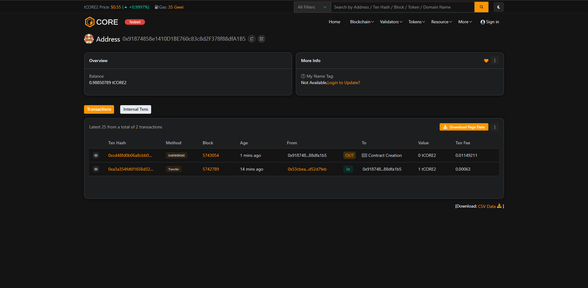

# Document Notary DApp

## 📌 Project Description
A decentralized application that registers document hashes on the blockchain for proof of existence.

## 🎯 Project Vision
To provide a transparent, tamper-proof way of verifying document authenticity using blockchain technology.

## 🔑 Key Features
- Store document hashes on-chain
- Record timestamp and submitter address
- Verify if a document has been registered

## 🔮 Future Scope
- Add web interface to upload & hash documents
- Admin-only document registration
- Tagging and categorizing documents

## 🧠 Contract Address
`0x8B96c4A2552046B8c451A71F057b0f32DA1AdC70`

## 🔗 Transaction Screenshot

